<div align="center">

# ♻️ AI-Powered Landfill Waste Forecasting

**Forecasting state-level landfill waste in the United States with machine learning: five models compared, the best one deployed as an interactive web app.**

*MSc in Artificial Intelligence, Applied Research Project · Dublin Business School · 2026*


| 🏆 Best model | R² | RMSE | MAE | Records | States | Years |
|:---:|:---:|:---:|:---:|:---:|:---:|:---:|
| **Linear Regression** | **0.9861** | **1.05M tons** | **0.58M tons** | 127,033 raw → 115,940 clean | 45 | 1938–2023 |

</div>

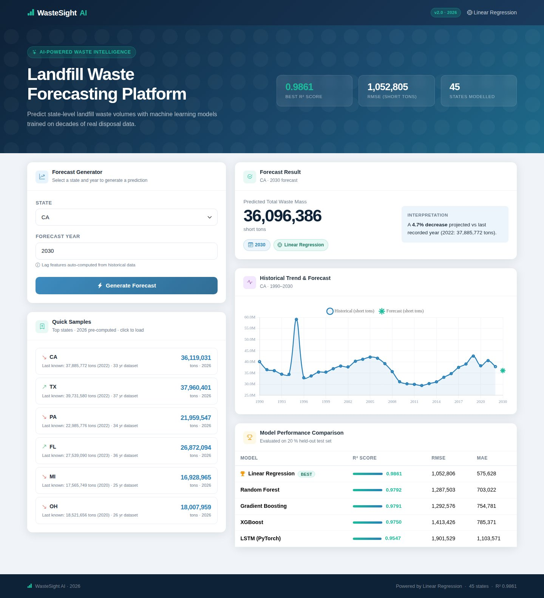

---

## 📑 Contents

1. [Overview](#-overview)
2. [Research question & objectives](#-research-question--objectives)
3. [Dataset](#-dataset)
4. [System architecture](#-system-architecture)
5. [Data preprocessing](#-data-preprocessing)
6. [Feature engineering](#-feature-engineering)
7. [Models](#-models)
8. [Training & evaluation protocol](#-training--evaluation-protocol)
9. [Results](#-results)
10. [Why did Linear Regression win?](#-why-did-linear-regression-win)
11. [Exploratory data analysis](#-exploratory-data-analysis)
12. [Web application & API](#-web-application--api)
13. [Project structure](#-project-structure)
14. [Getting started](#-getting-started)
15. [Limitations & future work](#-limitations--future-work)
16. [Author](#-author)

---

## 🔭 Overview

Landfill capacity is finite, and permitting new capacity takes years. If planners forecast too little waste, landfills run out of space; if they forecast too much, money is wasted on unneeded expansion. In the US these decisions are made **state by state**, yet most AI-for-waste research is conceptual, focuses on sorting and collection, or reports no comparable error metrics.

This project builds a **complete, reproducible forecasting pipeline**:

- **Raw data → clean data:** 127,033 facility-level records from the US *Landfilled Waste Composition Dataset* are cleaned and aggregated into state-year time series.
- **Feature engineering:** lagged values (1, 2 and 3 years) and a 3-year rolling mean of log-transformed waste mass.
- **Five model families** are trained on the same split and compared with the same metrics (RMSE, MAE, R²): Linear Regression, Random Forest, Gradient Boosting, XGBoost and a two-layer **PyTorch LSTM**.
- **Deployment:** the best model, with its encoders and scalers, is served by a **Flask REST API and dashboard** that forecasts any state's landfilled waste up to **2035**.

> **Key finding:** the simplest model won. With log-transformed targets and lag features, the relationship between past and current waste mass is close to linear. Linear Regression beat the tree ensembles by about 22% in RMSE and the LSTM by about 81%.

---

## ❓ Research question & objectives

> *Using historical landfill waste composition data aggregated at the state-year level, which of Linear Regression, Random Forest, Gradient Boosting, XGBoost and a two-layer LSTM gives the most accurate forecasts (by RMSE, MAE and R²), and can that model be deployed as a working web-based tool for landfill forecasting up to 2035?*

1. **Clean and aggregate** the dataset: remove formula artefacts and non-positive masses, and engineer lag and rolling-mean features.
2. **Train and evaluate five models** on a common held-out test set using RMSE, MAE and R².
3. **Select the best model** and explain why a simpler model can outperform ensemble and deep-learning approaches.
4. **Serialise and deploy** the model, encoders and scalers in a Flask app with interactive state-level forecasts.
5. **Assess feasibility** as a low-cost decision-support tool for sustainable landfill capacity planning.

---

## 📦 Dataset

**[Landfilled Waste Composition Dataset (Version 1)](https://catalog.data.gov/dataset/landfilled-waste-composition-dataset-version-1)**, published by the US Environmental Protection Agency, Office of Research and Development, on data.gov. A copy is included in [`dataset/`](dataset/).

| Property | Value |
|---|---|
| Raw records | **127,033** rows × 19 columns |
| After cleaning | **115,940** rows |
| States / territories | **45** |
| Years covered | **1938 – 2023** |
| Target | `Waste Mass (short tons)` |
| Key fields | State, Year, ORD-Designated Facility Type, ORD-Designated Waste Stream, Calendar or Fiscal |
| Largest waste streams | Uncategorized, MSW, CDD (construction & demolition), Other, Industrial |

Top states by total landfilled mass: **California (1.22B t)**, **Texas (1.04B t)**, **Pennsylvania (723M t)**, **Florida (592M t)**, **Michigan (436M t)** and **Ohio (397M t)**. Across all states the data covers about 7.77 billion short tons. State totals differ by more than **three orders of magnitude**, which is why the target is log-transformed.

---

## 🏗️ System architecture

<p align="center">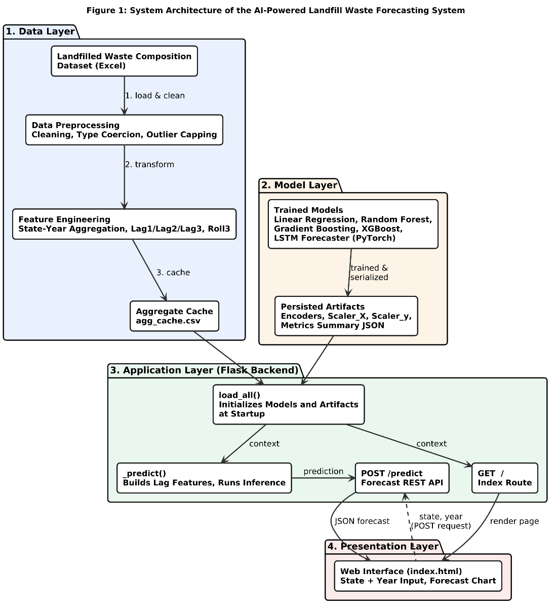</p>

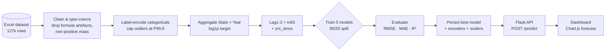

The system has four layers:

| Layer | Contents |
|---|---|
| **Data** | Raw Excel, preprocessing, cached state-year aggregates (`agg_cache.csv`) for fast start-up |
| **Model** | Serialised model, label encoders, feature/target scalers, `metrics_summary.json` |
| **Application** | Flask backend: loads artefacts once, rebuilds lag features per request, runs inference |
| **Presentation** | Dashboard: state/year picker, forecast card, historical trend chart, model leaderboard |

---

## 🧹 Data preprocessing

| Step | What & why |
|---|---|
| **Read cached formula values** | The workbook uses `XLOOKUP` formulas; `openpyxl` with `data_only=True` reads their computed values instead of formula strings. |
| **Drop formula artefacts** | Rows whose facility type or waste stream still starts with `=` are removed. |
| **Type coercion** | `Year` and `Waste Mass` are converted with `pd.to_numeric(errors="coerce")`; rows missing mass, year or state are dropped. |
| **Positive mass only** | Zero or negative masses aren't valid disposal events, so they are removed. |
| **Outlier capping** | The target is capped at the **99.9th percentile**, which limits extreme records without deleting them. |
| **Skew correction** | Target skewness goes from **34.35 (raw) to −0.47** after `log1p`. |

---

## 🧬 Feature engineering

Records are aggregated to **one row per state per year** (total waste mass), then each state's series is turned into supervised-learning features:

| Feature | Description |
|---|---|
| `State_enc` | Label-encoded state |
| `Year` | Calendar year |
| `yrs_since` | Years since the state's first record (position in its long-term trend) |
| `lag1`, `lag2`, `lag3` | log waste mass 1, 2 and 3 years earlier |
| `roll3` | 3-year rolling mean of the lags |
| **Target:** `log_total` | `log1p(total state-year waste mass)` |

This produces **716 state-year training samples across 39 states** (states need at least 3 prior years to build the lags). For inference, the app keeps all **846 state-year records across 45 states**; for states with short histories, missing lags are filled with the earliest available value.

---

## 🤖 Models

| # | Model | Configuration |
|---|---|---|
| 1 | **Linear Regression** | Standardised features *and* target (`StandardScaler`) |
| 2 | **Random Forest** | 200 trees, `max_depth=20`, `min_samples_leaf=5` |
| 3 | **Gradient Boosting** (scikit-learn) | 200 estimators, `max_depth=6`, `learning_rate=0.05`, `subsample=0.8`, `min_samples_leaf=10` |
| 4 | **XGBoost** | 300 estimators, `max_depth=8`, `learning_rate=0.05`, `subsample=0.8`, `colsample_bytree=0.8`, histogram method on the GPU (CUDA) |
| 5 | **LSTM** (PyTorch) | 2 stacked LSTM layers (hidden size 128, dropout 0.2), then a dense head: Linear(128→64) → ReLU → Dropout(0.1) → Linear(64→1). **207,489 parameters.** |

**LSTM training:** sliding windows of 3 years of raw state-year mass, Adam (`lr=1e-3`, `weight_decay=1e-5`), `ReduceLROnPlateau` (patience 10, factor 0.5), MSE loss, gradient clipping at 1.0, batch size 256, 150 epochs. The best checkpoint is restored before evaluation. Trained on an NVIDIA RTX 5090 Laptop GPU.

---

## 🧪 Training & evaluation protocol

- **Split:** 80/20 train/test (`random_state=42`), giving **572 training and 144 test samples**, the same for every model.
- **Scaling:** scalers are fit on the training data only and then applied to the test data.
- **Metrics:** **RMSE**, **MAE** and **R²**, computed on the **original short-ton scale** (predictions from log or scaled space are inverse-transformed first), using one shared `evaluate_model()` function so the numbers are directly comparable.
- **Selection:** models are ranked by R², and the winner is saved to `saved_models/` together with its encoders, scalers and a metrics summary.

---

## 📊 Results

### Leaderboard (held-out test set)

| Rank | Model | R² ↑ | RMSE (short tons) ↓ | MAE (short tons) ↓ | RMSE vs best | MAE vs best |
|:---:|---|:---:|---:|---:|:---:|:---:|
| 🥇 1 | **Linear Regression** | **0.9861** | **1,052,806** | **575,628** | — | — |
| 🥈 2 | Random Forest | 0.9792 | 1,287,503 | 703,022 | +22.3% | +22.1% |
| 🥉 3 | Gradient Boosting | 0.9791 | 1,292,576 | 754,781 | +22.8% | +31.1% |
| 4 | XGBoost | 0.9750 | 1,413,426 | 785,371 | +34.3% | +36.4% |
| 5 | LSTM (PyTorch) | 0.9547 | 1,901,529 | 1,103,571 | +80.6% | +91.7% |

<p align="center">
  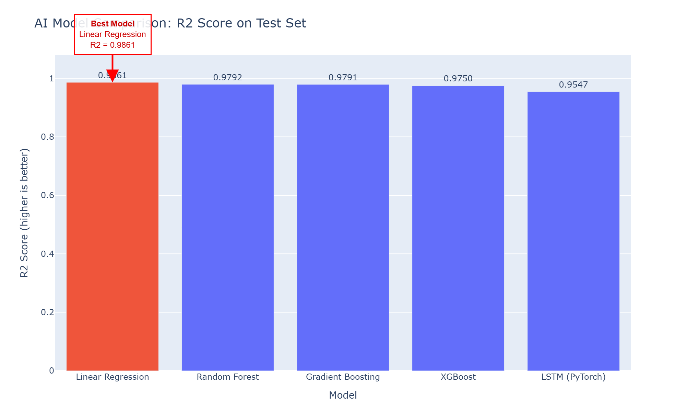
  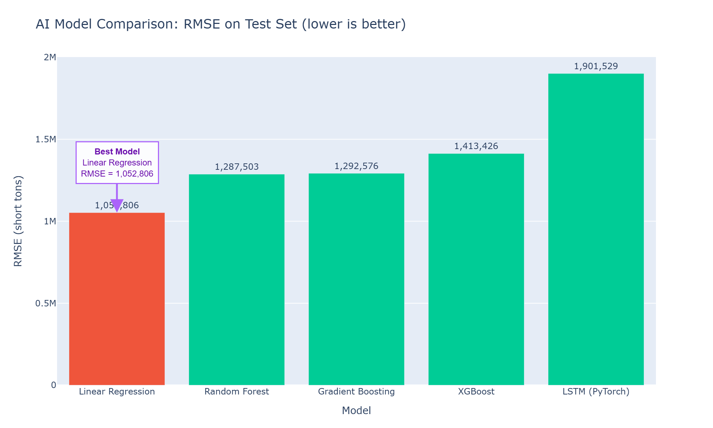
</p>
<p align="center">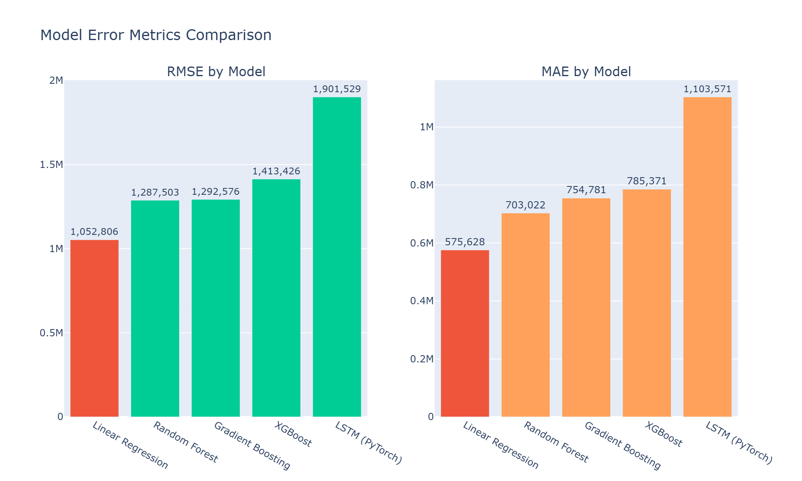</p>

### Error analysis

MAE is lower than RMSE for every model, because RMSE penalises large errors more heavily. The **gap between them shows how concentrated the errors are:**

| Model | RMSE − MAE gap |
|---|---:|
| Linear Regression | **477,178** (errors spread evenly across the test set) |
| Gradient Boosting | 537,795 |
| Random Forest | 584,482 |
| XGBoost | 628,055 |
| LSTM | **797,958** (a few large misses) |

Random Forest and Gradient Boosting are almost tied (ΔR² = 0.0002). XGBoost's extra machinery didn't help on a 7-feature dataset of this size.

### Sample forecasts (deployed Linear Regression model)

| State | Last observed | Forecast 2026 | Forecast 2030 |
|---|---:|---:|---:|
| California | 37,885,772 (2022) | 36,119,031 | 36,096,386 |
| Texas | 39,731,580 (2022) | 37,960,401 | 37,936,601 |
| Pennsylvania | 22,985,776 (2022) | 21,959,547 | 21,945,779 |
| Florida | 27,539,090 (2023) | 26,872,094 | 26,855,246 |
| Michigan | 17,565,749 (2020) | 16,928,965 | 16,918,350 |
| Ohio | 18,521,656 (2020) | 18,007,959 | 17,996,667 |

<sub>All values in short tons.</sub>

---

## 💡 Why did Linear Regression win?

1. **After the log transform the signal is mostly linear.** With `log_total` as the target, current waste mass is close to a linear function of recent lags, leaving little non-linear structure for trees or recurrent networks to exploit.
2. **Low-dimensional features.** Seven engineered features don't need deep trees or 200k-parameter networks.
3. **Short, uneven histories for the LSTM.** States average about **18.8 years** of records, some have fewer than 10, and the input window is only 3 steps. Recurrent models need longer and more consistent sequences to beat simple baselines.
4. **Ensembles overfit state-specific quirks.** With about 570 training rows, boosting and bagging learned patterns that didn't carry over to the test split.
5. **Interpretability is a bonus.** For public-sector planning, a transparent linear model that is also the most accurate is the best possible outcome.

The practical takeaway: **try the simple baseline first.** Here it beat GPU-accelerated XGBoost and a PyTorch LSTM.

---

## 🔍 Exploratory data analysis

<p align="center">
  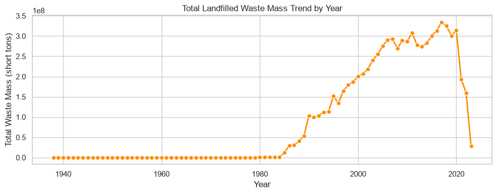
  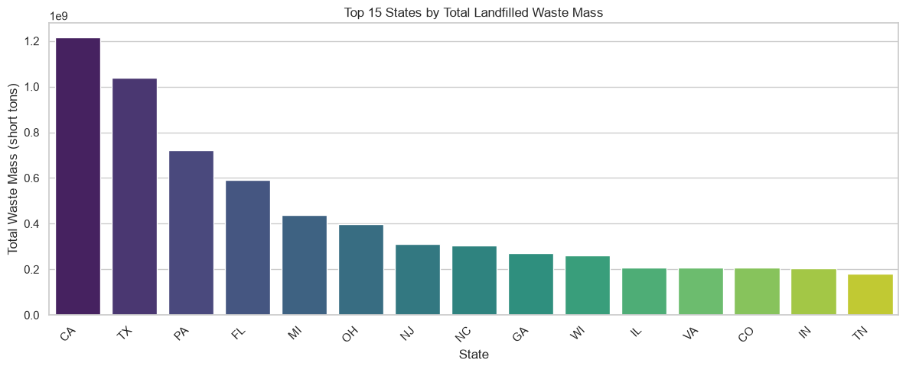
</p>
<p align="center">
  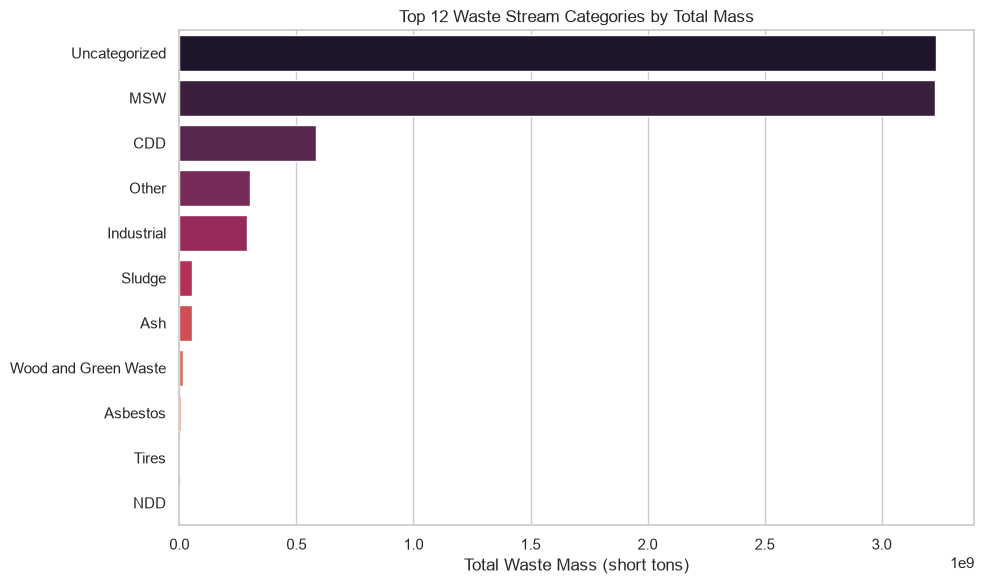
  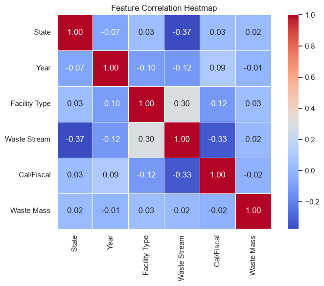
</p>
<p align="center">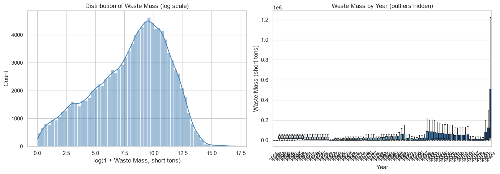</p>
<p align="center">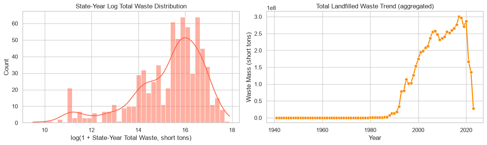</p>

> The sharp drop after about 2019 in the yearly total reflects **reporting coverage** (fewer states have reported the latest years), not a real fall in waste. This is another reason the model works from each state's own lags rather than national totals.

---

## 🌐 Web application & API

**WasteSight AI** is a Flask app with a responsive Bootstrap 5 + Chart.js dashboard:

- **Forecast generator:** pick any of 45 states and a year from 1980 to 2035.
- **Forecast card** with the predicted mass and a % change against the last recorded year.
- **Historical trend chart** with the forecast point overlaid.
- **Quick samples:** forecasts for the six highest-volume states, pre-computed at start-up.
- **Model leaderboard** read from `metrics_summary.json`.

### `POST /predict`

```bash
curl -X POST http://localhost:5000/predict \
     -H "Content-Type: application/json" \
     -d '{"state": "CA", "year": 2030}'
```

```json
{
  "state": "CA",
  "year": 2030,
  "prediction": 36096385.83,
  "model": "Linear Regression",
  "data_points": 33,
  "hist_years": [1990, 1991, 1992, "..."],
  "hist_vals": [40094296.0, 36504467.0, 36050325.0, "..."]
}
```

Input validation returns `400` with a JSON error for an unknown state, a non-numeric year, or a year outside **1980–2035**.

---

## 🗂️ Project structure

```
.
├── app.py                          # Flask app: loads artefacts, rebuilds features, serves forecasts
├── templates/index.html            # Dashboard (Bootstrap 5 + Chart.js)
├── notebooks/
│   └── landfill_waste_forecasting.ipynb   # EDA, preprocessing, 5-model training & evaluation
├── saved_models/
│   ├── best_model.joblib           # Linear Regression (best by R²)
│   ├── encoders.joblib             # LabelEncoders for categoricals
│   ├── scaler_X.joblib · scaler_y.joblib
│   ├── metrics_summary.json        # RMSE / MAE / R² for all five models
│   └── agg_cache.csv               # Cached state-year aggregates (fast start-up)
├── dataset/
│   └── Landfilled Waste Composition Dataset.xlsx
├── docs/figures · docs/screenshots
├── requirements.txt                # Serving dependencies
├── requirements-train.txt          # + torch, xgboost, plotting for the notebook
└── vercel.json
```

---

## 🚀 Getting started

**Run the forecasting app** (no GPU or PyTorch needed):

```bash
git clone https://github.com/alokekissac/AI-Landfill-Waste-Forecasting.git
cd AI-Landfill-Waste-Forecasting
python -m venv .venv && source .venv/bin/activate
pip install -r requirements.txt
python app.py                      # http://localhost:5000
```

**Re-train all five models:**

```bash
pip install -r requirements-train.txt
jupyter notebook notebooks/landfill_waste_forecasting.ipynb
```

The notebook uses a CUDA GPU when one is available and falls back to the CPU otherwise. Running it with newer library versions reproduces the same ranking, with Linear Regression first, though the numbers differ very slightly (for example, R² 0.984 instead of 0.986).

**Deploy to Vercel:** import the repo on [vercel.com/new](https://vercel.com/new) and click Deploy. `vercel.json` routes all requests to the Flask app, and the dataset, notebooks and docs are excluded from the serverless bundle.

---

## 🧭 Limitations & future work

**Limitations**
- **Uneven coverage:** some states have only a few years of data, which limits how far their forecasts can reasonably extrapolate.
- **Historical mass only:** the features don't include population, GDP or diversion and recycling policy.
- **One-step lags:** forecasts for years beyond the last observation reuse the latest three observed years as lags (no recursive roll-forward), so long-horizon forecasts change only through the trend terms.
- **Random split:** the train/test split isn't time-ordered; a walk-forward validation would be a stricter test of forecasting ability.
- **Short LSTM window:** 3 time steps may understate what recurrent models can do with richer data.

**Future work**
- Add socio-economic covariates (population, GDP, recycling and diversion rates).
- Use recursive multi-step forecasting and time-based back-testing.
- Report prediction intervals (quantile regression or conformal prediction) instead of only point forecasts.
- Try attention-based and hybrid statistical-neural models as longer histories become available.
- Forecast at the facility and waste-stream level, with scheduled retraining on new data.

---

## 👤 Author

**Aloke Kunjandi Issac**, AI Engineer & Full-Stack Developer · Dublin, Ireland
[GitHub](https://github.com/alokekissac) · [LinkedIn](https://www.linkedin.com/in/alokekisssac/)

Applied Research Project for the **MSc in Artificial Intelligence** at **Dublin Business School** (2026), supervised by **Dr. Devesh Jawla**.

<sub>Dataset: US EPA Office of Research and Development, <i>Landfilled Waste Composition Dataset, Version 1</i>, via data.gov.</sub>
